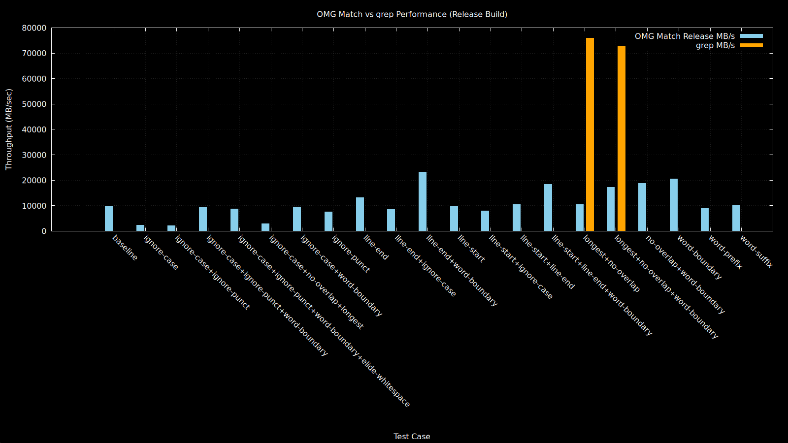
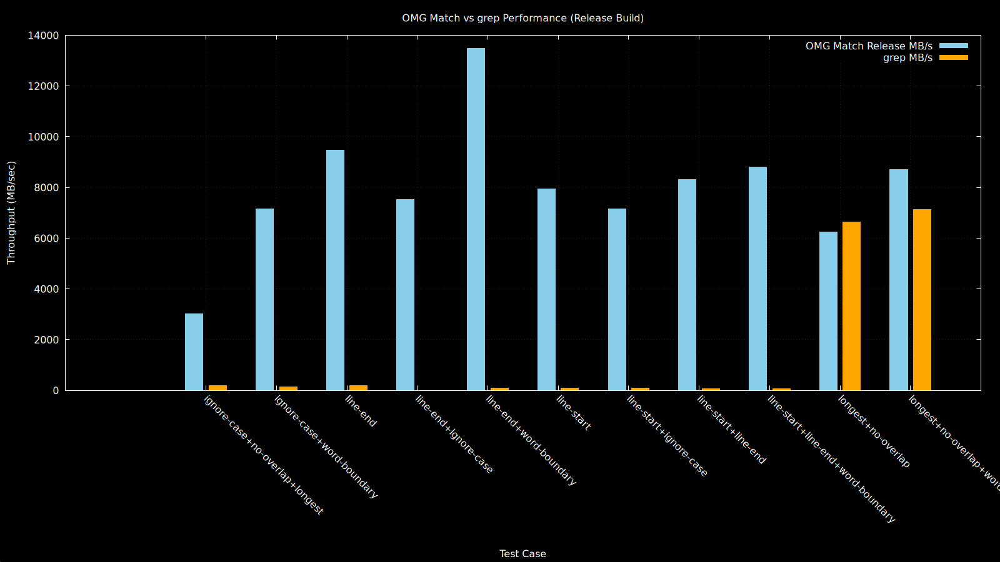

# OmegaMatch

[](https://github.com/scholarsmate/omega-match/actions/workflows/ci.yml)
[](https://github.com/scholarsmate/omega-match/actions/workflows/release.yml)
[](https://badge.fury.io/py/omega_match)
[](https://pypi.org/project/omega_match/)
[](https://www.apache.org/licenses/LICENSE-2.0)
[](https://github.com/scholarsmate/omega-match/releases)

OmegaMatch is a high-performance, multi-threaded, multi-pattern matching library written in C. It combines a Bloom filter, hash table, and optimized "short matcher" to scan large content for multiple patterns in parallel.

## Features

- Parallel matching using [OpenMP](https://www.openmp.org/)
- Bloom filter pre-filtering
- Exact match via highly optimized hash table scans and comparisons
- Specialized short matcher for patterns of length 1–4
- Post-processing filters: no-overlap, longest-only, word-boundary, and line anchors
- Optimized radix sort for results: length descending, offset ascending
- Optional case-insensitive, punctuation-ignoring, and whitespace-eliding transformations
- Configurable memory sanitizers and thread/chunk sizes
- **Persistable compiled pattern store:** compile patterns once to disk and memory-map for fast, concurrent reuse by multiple matcher instances with very low memory overhead.

## Build

This project uses CMake with flexible build presets:

### Standard Build (CLI tool + libraries)
```sh
cmake --preset release
cmake --build --preset release
ctest --preset release --output-on-failure
```

### Language Bindings Build (libraries only)
```sh
cmake --preset release -DOLM_BUILD_CLI=OFF
cmake --build --preset release
# The build directory depends on the preset, e.g., 'build-gcc-release' for the 'release' preset
cmake --install build-gcc-release --prefix /usr/local
```

This creates both static and shared libraries without the CLI tool, ideal for:
- Python bindings (ctypes, Cython, pybind11)
- Node.js native modules
- Go cgo bindings
- Rust FFI
- Any language that can call C libraries

### Building on Windows (MSVC)

From a *Developer Command Prompt for VS 2022*, run:

```sh
cmake --preset msvc-release
cmake --build --preset msvc-release
```

### Building on Linux (GCC)

```sh
cmake --preset release
cmake --build --preset release
```

### Building on macOS (Clang)

First, install `libomp` if you don't have it:
```sh
brew install libomp
```

Then run the build:
```sh
cmake --preset macos-release
cmake --build --preset macos-release
```

### Testing

After building, run the test suite using `ctest` with the same preset used for building:

```sh
ctest --preset <name-of-preset> --output-on-failure
```

For example:
```sh
ctest --preset release --output-on-failure
```

### Packaging

After building, installers can be created with CPack. Example:

```sh
# The CPack config is in the build directory, e.g., build-gcc-release
cpack -G TGZ --config build-gcc-release/CPackConfig.cmake
cpack -G DEB --config build-gcc-release/CPackConfig.cmake
cpack -G RPM --config build-gcc-release/CPackConfig.cmake
# on Windows with WiX installed
cpack -G WIX --config build-msvc-release/CPackConfig.cmake
```

## Performance Testing

OmegaMatch includes a comprehensive performance testing suite (`perf_test.py`) that benchmarks the library against grep-like tools when available. The test suite provides detailed performance metrics and correctness validation across multiple matching scenarios.

### Running Performance Tests

```sh
# Run all tests with status messages
python perf_test.py --show-status

# Run specific tests only
python perf_test.py --tests baseline,ignore-case,word-boundary --show-status

# Run without grep comparisons (useful on systems without grep)
python perf_test.py --no-grep --show-status

# List all available tests
python perf_test.py --tests list
```

### Test Results Overview

The performance test suite benchmarks many different matching scenarios with grep comparison where possible:

```sh
PS D:\GitHub\omega-match> python3.exe .\perf_test.py --show-status
[INFO] Running all 21 tests
[INFO] Debug binary: ./build-msvc-debug/Debug/olm.exe
[INFO] Release binary: ./build-msvc-release/Release/olm.exe
[INFO] Using `bash-grep` for grep comparisons
[INFO] Status messages enabled
[INFO] Status messages enabled

Test Case                                                | Debug MB/s   | Release MB/s | Grep MB/s    | Ratio    | Compare   
----------------------------------------------------------------------------------------------------------------------------------
baseline                                                 | 4262.54      | 7992.79      | N/A          | N/A      | N/A       
ignore-case                                              | 999.67       | 2360.44      | N/A          | N/A      | N/A       
ignore-case+ignore-punct                                 | 1024.10      | 2505.49      | N/A          | N/A      | N/A       
ignore-case+ignore-punct+word-boundary                   | 3724.81      | 7920.60      | N/A          | N/A      | N/A       
ignore-case+ignore-punct+word-boundary+elide-whitespace  | 3610.58      | 7235.59      | N/A          | N/A      | N/A       
ignore-case+no-overlap+longest                           | 1415.09      | 3004.38      | 210.29       | 14.29x   | OK        
ignore-case+word-boundary                                | 4096.64      | 8924.43      | 159.52       | 55.95x   | OK        
ignore-punct                                             | 3052.42      | 5951.75      | N/A          | N/A      | N/A       
line-end                                                 | 4872.53      | 9001.35      | 202.84       | 44.38x   | OK        
line-end+ignore-case                                     | 3960.01      | 6336.87      | 12.49        | 507.36x  | OK      
line-end+word-boundary                                   | 6579.95      | 11171.08     | 123.27       | 90.62x   | OK      
line-start                                               | 4063.12      | 8557.74      | 118.76       | 72.06x   | OK      
line-start+ignore-case                                   | 3418.66      | 6281.00      | 111.12       | 56.52x   | OK      
line-start+line-end                                      | 4793.94      | 7988.92      | 102.85       | 77.68x   | OK      
line-start+line-end+word-boundary                        | 6493.66      | 11275.96     | 98.32        | 114.69x  | OK      
longest+no-overlap                                       | 3845.69      | 7578.93      | 8696.32      | 0.87x    | OK      
longest+no-overlap+word-boundary                         | 6119.62      | 10660.46     | 9420.41      | 1.13x    | OK      
no-overlap+word-boundary                                 | 6504.39      | 9852.67      | N/A          | N/A      | N/A     
word-boundary                                            | 6071.29      | 9641.10      | N/A          | N/A      | N/A     
word-prefix                                              | 3499.79      | 6377.13      | N/A          | N/A      | N/A     
word-suffix                                              | 3906.00      | 7703.24      | N/A          | N/A      | N/A     
----------------------------------------------------------------------------------------------------------------------------------
[INFO] Performance test completed. Results saved to ./perf_results.csv.
```

### Understanding the Results

**Columns:**
- **Test Case**: The matching scenario being tested
- **Debug MB/s**: Throughput using debug build (MB/s)
- **Release MB/s**: Throughput using release build (MB/s)  
- **Grep MB/s**: Throughput using grep/grep-like tool (MB/s)
- **Ratio**: Performance ratio (Release OLM ÷ Grep)
- **Compare**: Correctness validation (`OK` means identical results)

**Performance Ratio Interpretation:**
- **1.0x**: Equivalent performance
- **>1.0x**: OmegaMatch is faster (e.g., `15.48x` = 15× faster)
- **<1.0x**: Grep is faster (e.g., `0.82x` = grep is 1.2× faster)

### Test Data

The performance tests use realistic datasets:
- **Patterns**: `data/names.txt` (surnames list, ~2,000 patterns)
- **Haystack**: `data/kjv.txt` (King James Bible, ~4MB text)
- **Workload**: Multi-threaded pattern matching with various options

### Targeted Testing

Run specific test categories:

```sh
# Test basic string matching performance
python perf_test.py --tests baseline,ignore-case,word-boundary

# Test line anchor performance (OmegaMatch's strength)
python perf_test.py --tests line-start,line-end,line-start+line-end

# Test word boundary variations
python perf_test.py --tests word-boundary,longest+word-boundary,no-overlap+word-boundary

# Test advanced combinations
python perf_test.py --tests ignore-case+word-boundary,longest+no-overlap+word-boundary
```

### Cross-Platform Testing

The test suite works across platforms:
- **Windows**: Uses `bash-grep` (Git Bash) or PowerShell-based grep
- **Linux**: Uses native `grep` command
- **macOS**: Uses BSD `grep` command
- **No grep**: Gracefully falls back to OmegaMatch-only benchmarking

Results are saved to `perf_results.csv` for further analysis and plotting.

### Performance Visualization

OmegaMatch includes Gnuplot scripts to create publication-quality performance charts from the test results:

```sh
# Run performance tests (creates perf_results.csv, used by perf_plot.gp)
python perf_test.py --show-status

# Generate performance chart (requires gnuplot)
gnuplot perf_plot.gp
```

This creates `perf_results.png` with a comprehensive performance comparison chart:



You can also create focused charts for specific test categories:

```sh
# Create chart for grep-comparable tests only using git bash on a Windows 11 Pro "Dev Drive"
python.exe perf_test.py --show-status --tests ignore-case+no-overlap+longest,ignore-case+word-boundary,line-end,line-end+ignore-case,line-end+word-boundary,line-start,line-start+ignore-case,line-start+line-end,line-start+line-end+word-boundary,longest+no-overlap,longest+no-overlap+word-boundary

# Run gnuplot in WSL
gnuplot perf_plot.gp
```



**Chart Features:**
- **Side-by-side bars** comparing OmegaMatch Release vs Grep performance
- **Logarithmic scale** to handle wide performance ranges (0.1x to 500x+)
- **Color coding** to distinguish OmegaMatch (blue) vs Grep (orange) results
- **Automatic scaling** based on available test data
- **Publication quality** suitable for papers, presentations, and documentation

**Requirements:**
- **Gnuplot 5.0+** installed
- Performance test results in `perf_results.csv`
- The script automatically handles missing grep data (N/A values)

## Profile Guided Optimization (PGO) Builds

OmegaMatch supports Profile Guided Optimization (PGO) for maximum performance. PGO builds can provide and additional **5-20% better performance** than standard builds by optimizing based on real-world usage patterns.

### Quick Start - PGO Builds

Use the unified PGO workflow script for any platform:

```bash
# Linux/WSL - GCC PGO (most stable)
python3 scripts/pgo_workflow.py --compiler gcc

# Linux/WSL - Clang PGO (often fastest)
python3 scripts/pgo_workflow.py --compiler clang

# Windows - MSVC PGO
python scripts/pgo_workflow.py --compiler msvc
```

### Available PGO Variants

| Variant | Platform | Compiler | Performance Gain | Best For |
|---------|----------|----------|------------------|----------|
| `linux-x64-gcc-pgo` | Linux x64 | GCC | +10-15% | Production workloads, stability |
| `linux-x64-clang-pgo` | Linux x64 | Clang | +15-20% | Maximum performance |
| `windows-x64-msvc-pgo` | Windows x64 | MSVC | +5-10% | Windows applications |

### Selecting the Best PGO Variant

Use the selection helper to find the optimal variant for your platform:

```bash
python scripts/select_pgo_variant.py
```

Example output:
```
🚀 OmegaMatch PGO Variant Selection Guide
==================================================
Detected Platform: linux-x64

✅ Compatible Variants:
1. Standard Linux x64 build (no PGO)
   Optimization: None
   Best for: General use, compatibility

2. Linux x64 with GCC Profile Guided Optimization  
   Optimization: PGO (GCC)
   Best for: High performance, production workloads

3. Linux x64 with Clang Profile Guided Optimization
   Optimization: PGO (Clang) 
   Best for: Maximum performance, modern LLVM optimizations

🎯 Recommendations:
⚡ Maximum Performance: Linux x64 with Clang Profile Guided Optimization
🔧 Maximum Compatibility: Standard Linux x64 build (no PGO)
```

### Manual PGO Build Process

For advanced users, you can build PGO variants manually:

#### Step 1: Build Instrumented Binary
```bash
# Configure for PGO instrumentation
cmake --preset gcc-pgo-generate    # or clang-pgo-generate, msvc-pgo-generate
cmake --build --preset gcc-pgo-generate
```

#### Step 2: Run Training Workloads
```bash
# Run comprehensive training (automatic)
python3 scripts/pgo_workflow.py --compiler gcc

# Or run custom training workloads
cd build-gcc-pgo-generate
./olm compile /tmp/patterns.olm ../data/names.txt
./olm match --threads 4 --longest --no-overlap /tmp/patterns.olm ../data/kjv.txt
# Add more workloads representative of your use case...
```

#### Step 3: Build Optimized Binary
```bash
# Configure for PGO optimization
cmake --preset gcc-pgo-use
cmake --build --preset gcc-pgo-use

# Test the optimized build
ctest --test-dir build-gcc-pgo-use --output-on-failure
```

### PGO Training Workloads

The automated PGO training includes comprehensive workloads:

- **Basic Operations**: Help, version commands
- **Pattern Compilation**: Various pattern types and sizes
- **Matching Modes**: Case sensitivity, word boundaries, longest match, no-overlap
- **Threading**: Single and multi-threaded execution (1, 2, 4, 8 threads)
- **Chunk Sizes**: Various buffer sizes (512B to 16KB)
- **Advanced Features**: Line anchors, whitespace handling, output modes
- **Stress Testing**: Complex flag combinations simulating real-world usage

### Testing PGO Performance

Compare PGO vs standard builds:

```bash
# Automated performance comparison
python scripts/compare_pgo_performance.py

# Manual benchmarking
python perf_test.py --build-dir build-gcc-release
python perf_test.py --build-dir build-gcc-pgo-use
```

### VS Code Integration

PGO workflows are available as VS Code tasks:

- **Ctrl+Shift+P** → "Tasks: Run Task"
- Select "PGO Workflow - GCC", "PGO Workflow - Clang", or "PGO Workflow - MSVC"

### CI/CD PGO Integration

The CI/CD pipeline automatically builds PGO variants for releases:

- **Linux**: GCC PGO and Clang PGO variants
- **Windows**: MSVC PGO variant  
- **Artifacts**: All PGO variants available in GitHub releases
- **Python Wheel**: Includes all PGO variants with automatic selection

### Troubleshooting PGO Builds

**No profile data generated:**
```bash
# Check training execution
python3 scripts/pgo_workflow.py --compiler gcc 2>&1 | grep -i "error\|failed"

# Verify data files exist
ls -la data/
```

**Performance regression:**
```bash
# Check if training matches your workload
python scripts/compare_pgo_performance.py

# Add custom training workloads to pgo_workflow.py
```

**Build failures:**
```bash
# Clean and retry
python3 scripts/pgo_workflow.py --compiler gcc --clean

# Check compiler versions
gcc --version
cmake --version
```

For more details, see [PGO CI/CD Integration Guide](PGO_CI_CD_GUIDE.md).

## Usage

### Command-line tool

```sh
./olm <command> <patterns> <input_file> [options]
```

**Commands:**

-  `compile`    Compile patterns
-  `match`      Match patterns

**Compile Command Options:**

- `--ignore-case`         Ignore case in patterns
- `--ignore-punctuation`  Ignore punctuation in patterns
- `--elide-whitespace`    Remove whitespace in patterns
- `-v, --verbose`         Enable verbose output
- `-h, --help`            Show this help message

**Match Command Options:**

- `-o, --output FILE`     Write results to FILE instead of stdout (UTF-8 and LF EOL)
- `--ignore-case`         Ignore case during matching
- `--ignore-punctuation`  Ignore punctuation during matching
- `--elide-whitespace`    Remove whitespace during matching
- `--longest`             Only return longest matches
- `--no-overlap`          Avoid overlapping matches
- `--word-boundary`       Only match at word boundaries
- `--word-prefix`         Only match at word prefixes
- `--word-suffix`         Only match at word suffixes
- `--line-start`          Only match at the start of a line
- `--line-end`            Only match at the end of a line
- `--threads N`           Number of threads to use
- `--chunk-size N`        Chunk size for parallel processing
- `-v, --verbose`         Enable verbose output
- `-h, --help`            Show this help message

### C API

```c
#include <omega/list_matcher.h>

// Create matcher (compiling patterns if needed)
omega_list_matcher_t *m = omega_list_matcher_create("patterns.txt", /*case_insensitive=*/0, /*ignore_punctuation=*/0, /*elide_ws=*/0, NULL);

// Perform match on buffer
const uint8_t *data = ...; size_t len = ...;
omega_match_results_t *r = omega_list_matcher_match(m, data, len, /*no_overlap=*/1, /*longest_only=*/1, /*word_boundary=*/1, /*word_prefix=*/0, /*word_suffix=*/0);

// Iterate results
for (size_t i = 0; i < r->count; ++i) {
  printf("match at %zu length %u\n", r->matches[i].offset, r->matches[i].len);
}

omega_match_results_destroy(r);
omega_list_matcher_destroy(m);
```

## Python Language Bindings

OmegaMatch provides Python bindings with a clean, Pythonic API that wraps the high-performance native C library. The bindings support all major platforms (Linux, macOS, Windows) and Python versions 3.9+.

**🚀 Performance Optimized**: The Python package automatically selects the best available PGO (Profile Guided Optimization) variant for your platform, providing **5-20% better performance** than standard builds without any configuration required.

### Installation

```bash
pip install omega_match
```

The package includes multiple optimized native library variants:
- **Linux x64**: Standard, GCC PGO, and Clang PGO variants
- **Linux ARM64**: Optimized for ARM processors  
- **Windows x64**: Standard and MSVC PGO variants
- **macOS ARM64**: Apple Silicon optimized

The best variant is automatically selected at runtime based on your platform.

### Quick Start

```python
from omega_match.omega_match import Compiler, Matcher

# Compile patterns
patterns = ["foo", "bar", "bazinga"]
with open("patterns.txt", "w") as f:
    f.write("\n".join(patterns))

# Create compiled matcher file
stats = Compiler.compile_from_filename("matcher.olm", "patterns.txt")
print(f"Compiled {stats.stored_pattern_count + stats.short_pattern_count} patterns")

# Load matcher and search
with Matcher("matcher.olm") as matcher:
    haystack = b"foo bar test bazinga"
    results = matcher.match(haystack)
    
    for result in results:
        print(f"Found '{result.match.decode()}' at offset {result.offset}")
```

### API Reference

#### Compiler Class

The `Compiler` class handles pattern compilation and supports both streaming and batch compilation:

```python
# Streaming compilation
with Compiler("output.olm", case_insensitive=True) as compiler:
    compiler.add_pattern(b"pattern1")
    compiler.add_pattern(b"pattern2")
    stats = compiler.get_stats()

# Batch compilation from file
stats = Compiler.compile_from_filename("output.olm", "patterns.txt", 
                                       case_insensitive=True)

# Batch compilation from buffer
pattern_buffer = b"foo\nbar\nbaz"
stats = Compiler.compile_from_buffer("output.olm", pattern_buffer)
```

**Compiler Options:**
- `case_insensitive`: Normalize patterns to uppercase for case-insensitive matching.
- `ignore_punctuation`: Remove punctuation from patterns during compilation.
- `elide_whitespace`: Remove whitespace from patterns during compilation.

#### Matcher Class

The `Matcher` class performs pattern matching on data:

```python
with Matcher("compiled.olm") as matcher:
    results = matcher.match(haystack,
                           no_overlap=True,      # Suppress overlapping matches
                           longest_only=True,    # Keep only longest at each position
                           word_boundary=True,   # Match only at word boundaries
                           word_prefix=False,    # Match at word start
                           word_suffix=False,    # Match at word end
                           line_start=False,     # Match at line start
                           line_end=False)       # Match at line end
    
    # Configure threading
    matcher.set_threads(4)        # Use 4 threads for matching
    matcher.set_chunk_size(1024)  # OpenMP chunk size
```

#### Match Results

Each match result contains:

```python
for result in results:
    print(f"Offset: {result.offset}")      # Byte offset in haystack
    print(f"Length: {result.length}")      # Match length in bytes
    print(f"Match: {result.match}")        # Matched bytes (bytes object)
```

#### Statistics

Get compilation and matching statistics:

```python
# Pattern store statistics (from compilation)
stats = compiler.get_stats()
print(f"Total patterns: {stats.stored_pattern_count + stats.short_pattern_count}")
print(f"Input bytes: {stats.total_input_bytes}")
print(f"Stored bytes: {stats.total_stored_bytes}")

# Match statistics (from matching operations)
match_stats = matcher.get_match_stats()
print(f"Total hits: {match_stats.total_hits}")
print(f"Total attempts: {match_stats.total_attempts}")
matcher.reset_match_stats()  # Reset counters
```

### Advanced Usage

#### Case-Insensitive and Normalized Matching

```python
# Compile with normalization options
with Compiler("normalized.olm", 
              case_insensitive=True,
              ignore_punctuation=True,
              elide_whitespace=True) as compiler:
    compiler.add_pattern(b"Hello, World!")
    
# The pattern will match "helloworld", "HELLO WORLD", etc.
with Matcher("normalized.olm",
             case_insensitive=True,
             ignore_punctuation=True,
             elide_whitespace=True) as matcher:
    results = matcher.match(b"Say: hello world!")
```

#### Word Boundary Matching

```python
with Matcher("words.olm") as matcher:
    text = b"The cat catches cats"
    
    # Match "cat" only as complete words (not in "catches" or "cats")
    results = matcher.match(text, word_boundary=True)
    
    # Match only at word starts
    results = matcher.match(text, word_prefix=True)
    
    # Match only at word ends  
    results = matcher.match(text, word_suffix=True)
```

#### Line-Based Matching

```python
with Matcher("lines.olm") as matcher:
    text = b"start of line\nmiddle\nend of line"
    
    # Match only at line start
    results = matcher.match(text, line_start=True)
    
    # Match only at line end
    results = matcher.match(text, line_end=True)
```

#### Performance Tuning

```python
with Matcher("patterns.olm") as matcher:
    # Configure for your workload
    matcher.set_threads(8)         # Use all CPU cores
    matcher.set_chunk_size(4096)   # Larger chunks for big data
    
    # Process large data efficiently
    large_data = b"..." * 1000000
    results = matcher.match(large_data)
```

### Cross-Platform Support

The Python package includes pre-built native libraries for:
- **Linux x64**: Standard, GCC PGO (+10-15%), Clang PGO (+15-20%)
- **Linux ARM64**: Optimized for ARM64 processors
- **macOS ARM64**: Apple Silicon optimized (M1, M2, M3, etc.)
- **Windows x64**: Standard and MSVC PGO (+5-10%)

The optimal library variant is automatically selected based on:
1. **Platform detection** (OS and architecture)
2. **Performance requirements** (PGO variants preferred)
3. **Compatibility fallback** (standard builds if needed)

**PGO Variant Selection**: The Python bindings use intelligent variant selection to provide maximum performance:

```python
import omega_match

# Automatically uses the best PGO variant available
# - Linux: Prefers Clang PGO > GCC PGO > Standard
# - Windows: Prefers MSVC PGO > Standard  
# - macOS: Uses optimized standard build (PGO coming soon)
matcher = omega_match.Matcher("patterns.olm")
```

You can check which variant is being used:

```python
import omega_match
print(f"Using variant: {omega_match.get_library_info()['variant']}")
print(f"Performance level: {omega_match.get_library_info()['optimization']}")
```

### Command-Line Tool (olm.py)

The Python package includes `olm.py`, a command-line tool that mirrors the functionality of the native `olm` binary. This tool provides a pure Python interface for pattern compilation and matching operations, making it easy to use OmegaMatch from the command line on any platform where Python is available.

You can use `olm.py` to:
- Compile large pattern lists into efficient matcher files for fast repeated searches.
- Search for multiple patterns in large text or binary files, with support for advanced options like word boundaries, no-overlap, and multi-threading.
- Integrate high-performance pattern matching into your data pipelines or automation scripts without writing any C code.

#### Example

Finding names from the King James version of the Bible:

```powershell
.\build-msvc-release\Release\olm.exe match --no-overlap --word-boundary --longest .\data\names.txt .\data\kjv.txt
```

You can also use the Python CLI version (works on all platforms):

```bash
python -m omega_match.olm match --no-overlap --word-boundary --longest data/names.txt data/kjv.txt
```

#### Usage

```bash
# Compile patterns from a file into a matcher
python -m omega_match.olm compile patterns.olm patterns.txt

# Match patterns in a haystack file  
python -m omega_match.olm match patterns.olm haystack.txt
```

#### Commands and Options

**Compile Command:**
```bash
python -m omega_match.olm compile <output.olm> <patterns.txt> [options]
```
- `--ignore-case`         Ignore case in patterns
- `--ignore-punctuation`  Ignore punctuation in patterns
- `--elide-whitespace`    Remove whitespace in patterns
- `-v, --verbose`         Enable verbose output

**Match Command:**
```bash
python -m omega_match.olm match <compiled.olm> <haystack.txt> [options]
```
- `--ignore-case`         Ignore case during matching
- `--ignore-punctuation`  Ignore punctuation during matching
- `--elide-whitespace`    Remove whitespace during matching
- `--longest`             Only return longest matches
- `--no-overlap`          Avoid overlapping matches
- `--word-boundary`       Only match at word boundaries
- `--word-prefix`         Only match at word prefixes
- `--word-suffix`         Only match at word suffixes
- `--line-start`          Only match at line starts
- `--line-end`            Only match at line ends
- `--threads N`           Number of threads to use
- `--chunk-size N`        Chunk size for parallel processing
- `-v, --verbose`         Enable verbose output

#### Example

```bash
# Compile a pattern list with normalization
python -m omega_match.olm compile mypatterns.olm mypatterns.txt --ignore-case --elide-whitespace -v

# Match patterns with filtering options
python -m omega_match.olm match mypatterns.olm input.txt --longest --no-overlap --threads 4 -v
```

The output format matches the native `olm` binary: each match is reported as `offset:matched_text` (one per line, with Unix-style newlines).

## Implementation Details

OmegaMatch uses a two-tier matching pipeline:

- **Bloom filter** for fast pre-filtering of candidate positions.
- **Hash table scan** for exact matches of patterns of length ≥ 5.
- **Short matcher** optimized for patterns of length 1–4 (bitmap lookup and binary search).
- **Radix sort** (length desc, offset asc) followed by optional post-filters:
  - No-overlap
  - Longest-only
  - Word-boundary, prefix, and suffix checks
- **Transform table** (when enabled) for case-insensitive, punctuation-ignoring, and whitespace-eliding transformations.
- **Compiled pattern store** is serialized into a compact binary format and memory-mapped by each matcher, enabling low startup cost, minimal per-instance memory overhead, and parallel sharing across threads or processes.

## Compiler Options

Supported compilers: GCC, Clang, MSVC (via CMake).

- Requires **C11** support and **OpenMP**.
- CMake options:
  - `-DENABLE_SANITIZERS=ON|OFF`   Enable AddressSanitizer and UndefinedBehaviorSanitizer
  - `-DCMAKE_BUILD_TYPE=<Debug|Release>`  Select build type
- Recommended flags for high performance:
  - `-O3`
  - `-fopenmp` (or `/openmp` for MSVC)

## Performance

- Benchmarks in `perf_test.py` and Gnuplot script `perf_plot.gp`.
- Consider using `-DENABLE_SANITIZERS=OFF` for maximum speed.
- Adjust `--threads` and `--chunk-size` options to tune parallel load.

## CI/CD

This project uses GitHub Actions for Continuous Integration and Continuous Deployment.

- **CI Pipeline (`ci.yml`):** On every push and pull request to `main`, the CI pipeline builds and tests the project on Windows (MSVC), Linux (GCC), and macOS (Clang) across x64 and ARM64 architectures.
- **Release Pipeline (`release.yml`):** When a new tag matching `v*` is pushed, the release pipeline builds, tests, and packages the project. It creates platform-specific installers (DEB, RPM, TGZ, WIX), builds a universal Python wheel, publishes it to PyPI, and creates a GitHub Release with all the generated artifacts.

## Used By

- [OmegaOMG](https://github.com/scholarsmate/omega-omg) - OmegaOMG is an efficient Object Matching Grammar (OMG) that looks and feels like regex

## License

The OmegaMatch project is licensed under the [Apache License 2.0](LICENSE).

OmegaMatch is not an official Apache Software Foundation (ASF) project.
